

  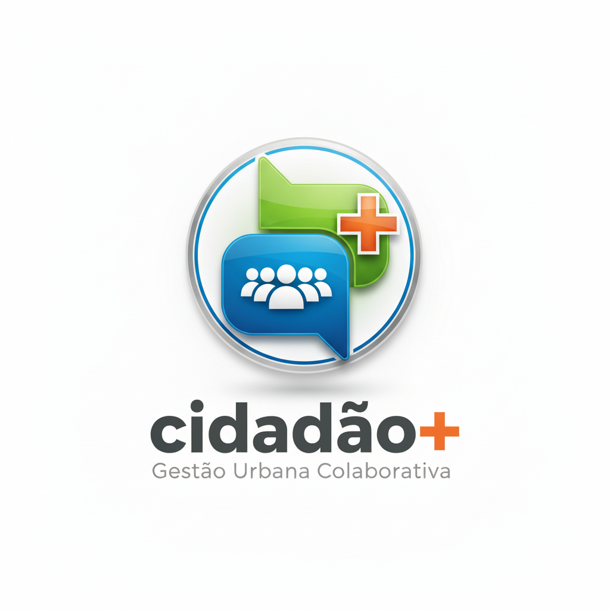

  # Cidadão+ | Gestão Urbana Inteligente

  **Plataforma digital para participação cidadã e gestão de ocorrências urbanas**

   

  
  
  
  

    

  🎓 **Projeto de Aptidão Profissional (PAP)**  
  📚 **Curso:** Técnico de Gestão e Programação de Sistemas Informáticos  
  📅 **Ano:** 2026

---

## 📖 Sobre o Projeto

O **Cidadão+** é uma plataforma web desenvolvida para aproximar **cidadãos e entidades públicas**, permitindo o reporte e acompanhamento de ocorrências urbanas de forma digital.

A plataforma permite que os cidadãos comuniquem problemas existentes na sua área e acompanhem o respetivo estado de resolução, enquanto os administradores dispõem de ferramentas para gerir utilizadores, ocorrências e informação administrativa.

O projeto foi desenvolvido como **Prova de Aptidão Profissional**, tendo como objetivo aplicar conhecimentos de desenvolvimento web, bases de dados, segurança e gestão de sistemas.

---

## 🎯 Objetivos

O projeto foi desenvolvido com os seguintes objetivos:

- 📍 Facilitar o reporte de ocorrências urbanas
- 📊 Permitir o acompanhamento do estado das ocorrências
- 🏛️ Disponibilizar ferramentas de gestão para administradores
- 👥 Centralizar informação relacionada com cidadãos e ocorrências
- 🔐 Implementar mecanismos de autenticação e segurança
- 📧 Automatizar processos relacionados com recuperação de conta e autenticação

---

## ✨ Principais Diferenciais

### 📍 Georreferenciação

Permite associar ocorrências a uma localização, facilitando a identificação e gestão dos problemas reportados.

### 📊 Gestão Centralizada

O painel administrativo permite gerir diferentes áreas da plataforma a partir de um único local.

### 🔐 Segurança

O sistema inclui mecanismos de proteção de contas, utilização de **Bcrypt** para passwords e autenticação de dois fatores através de **2FA**.

### 📧 Comunicação por E-mail

O sistema utiliza **PHPMailer** para processos relacionados com recuperação de conta e envio de tokens de autenticação.

---

## 🛠️ Tecnologias Utilizadas

| Área | Tecnologia | Utilização |
| :--- | :--- | :--- |
| **Backend** | `PHP 8.x` | Lógica da aplicação e processamento do sistema |
| **Frontend** | `HTML5` | Estrutura das páginas |
| **Frontend** | `CSS3` | Estilização e responsividade |
| **Frontend** | `JavaScript` | Interatividade e funcionalidades dinâmicas |
| **Base de Dados** | `MySQL` | Armazenamento e gestão dos dados |
| **Segurança** | `Bcrypt` | Hashing seguro de passwords |
| **Autenticação** | `2FA` | Camada adicional de segurança |
| **E-mail** | `PHPMailer` | Envio de e-mails e tokens |

---

# 🚀 Funcionalidades

## 👤 Área do Cidadão

- 📍 Reporte de ocorrências
- 🖼️ Submissão de imagens
- 🏷️ Seleção de categorias
- 📊 Dashboard pessoal
- 👤 Gestão do perfil
- 🔐 Autenticação segura
- 🔑 Recuperação de password
- 🛡️ Autenticação de dois fatores

---

## ⚙️ Área Administrativa

- 👥 Gestão de utilizadores
- ✏️ Edição de dados
- 📋 Gestão de ocorrências
- 📊 Visualização de informação
- 🗺️ Gestão de freguesias
- 🔐 Gestão de permissões

---

# 🔐 Segurança

A segurança foi uma das áreas consideradas durante o desenvolvimento do projeto.

### Medidas implementadas

- 🔒 Passwords protegidas através de **Bcrypt**
- 🛡️ Autenticação de dois fatores
- 📧 Validação através de tokens enviados por e-mail
- 🔑 Sistema de recuperação de conta
- 👥 Controlo de permissões de utilizadores

---

# 📸 Demonstração

## 🔐 Módulo 1 — Acesso e Autenticação

<b>Ver imagens</b>

 

| Página Inicial | Login | Registo |
| :---: | :---: | :---: |
| 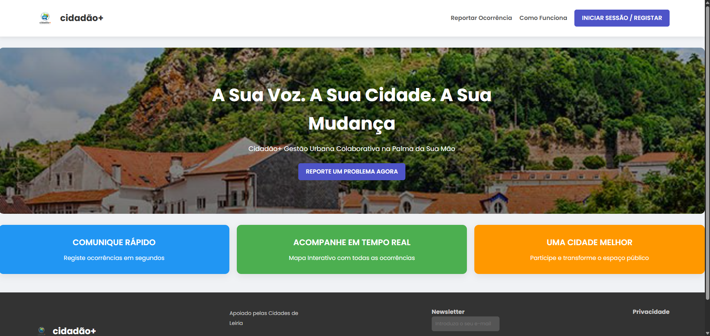 | 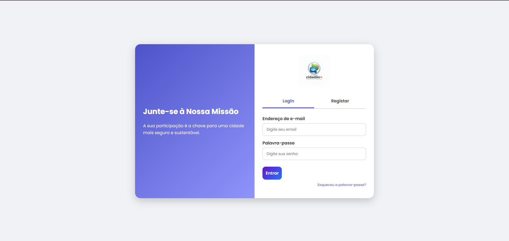 | 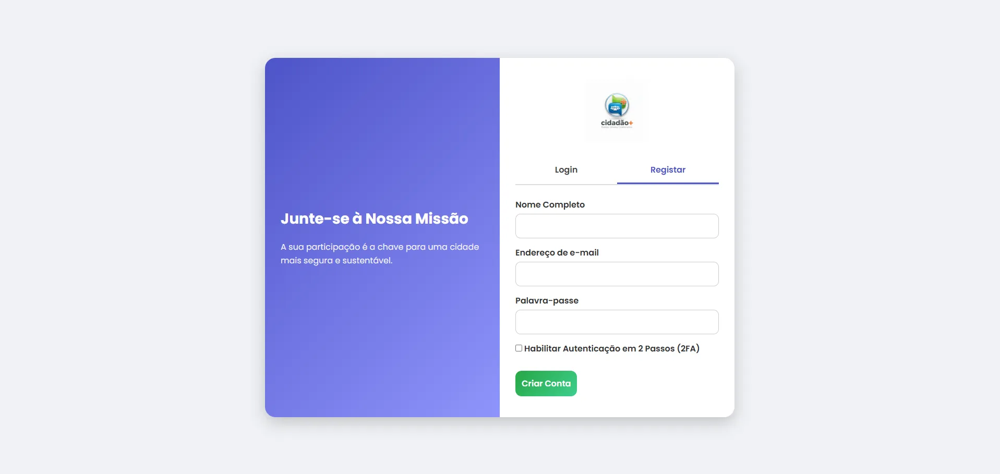 |

---

## 🛡️ Módulo 2 — Segurança & 2FA

<b>Ver imagens</b>

 

| Recuperação | Validação 2FA | Token E-mail |
| :---: | :---: | :---: |
| 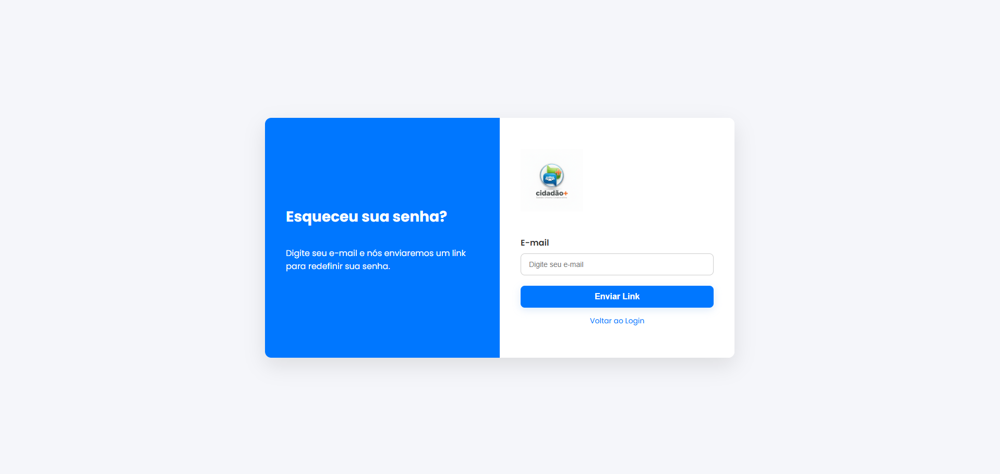 | 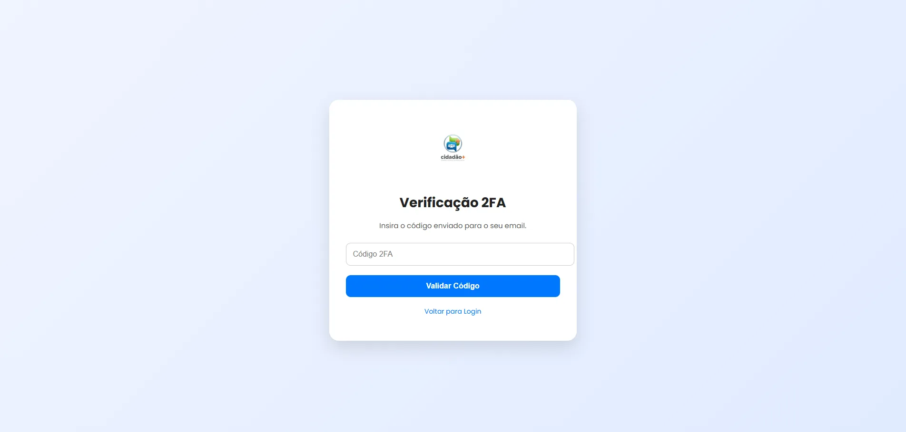 | 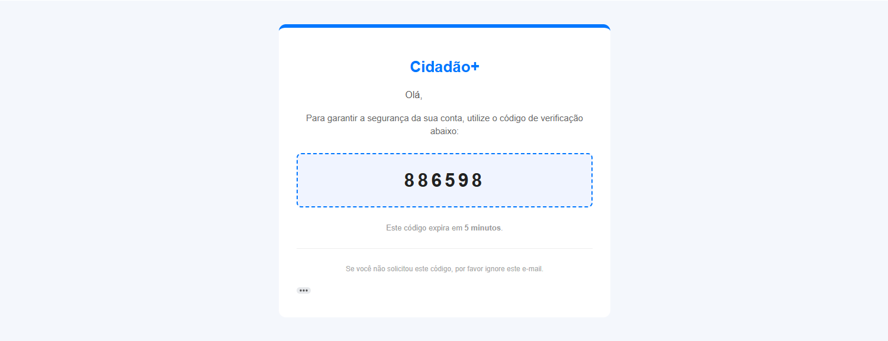 |

---

## 🙋‍♂️ Módulo 3 — Painel do Cidadão

<b>Ver imagens</b>

 

| Reportar Ocorrência | Dashboard Pessoal | Perfil de Utilizador |
| :---: | :---: | :---: |
| 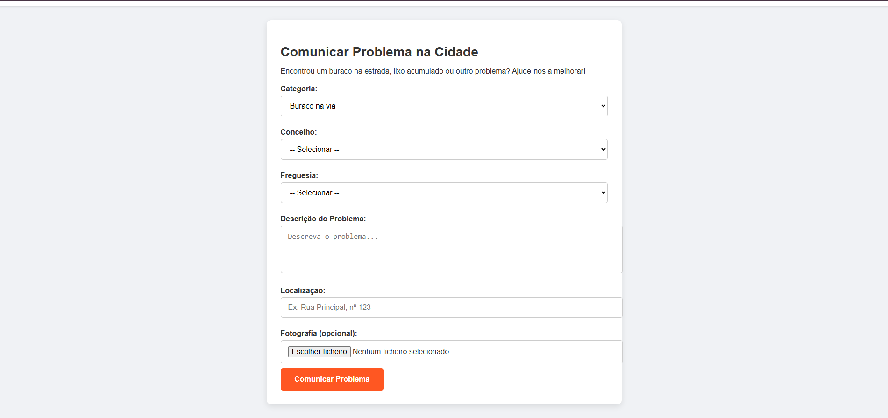 | 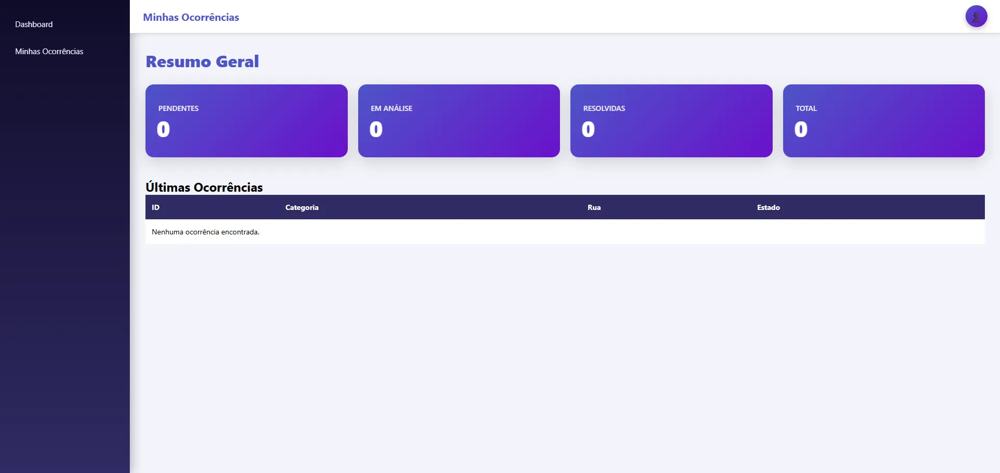 | 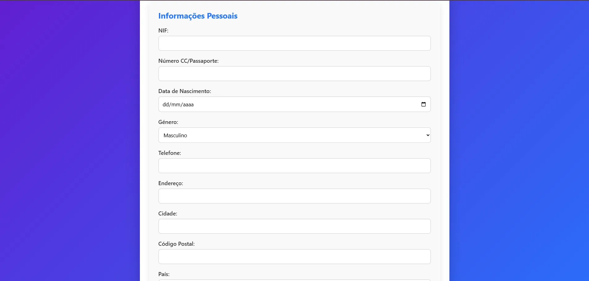 |

---

## ⚙️ Módulo 4 — Painel Administrativo

<b>Ver imagens</b>

 

| Gestão de Utilizadores | Editar Dados | Ocorrências | Freguesias |
| :---: | :---: | :---: | :---: |
| 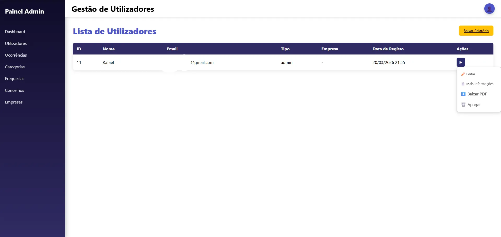 | 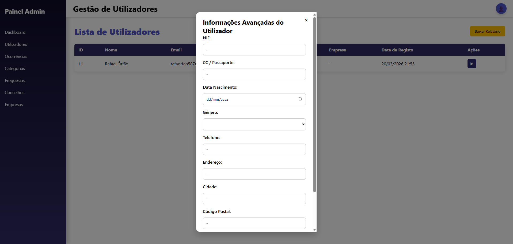 | 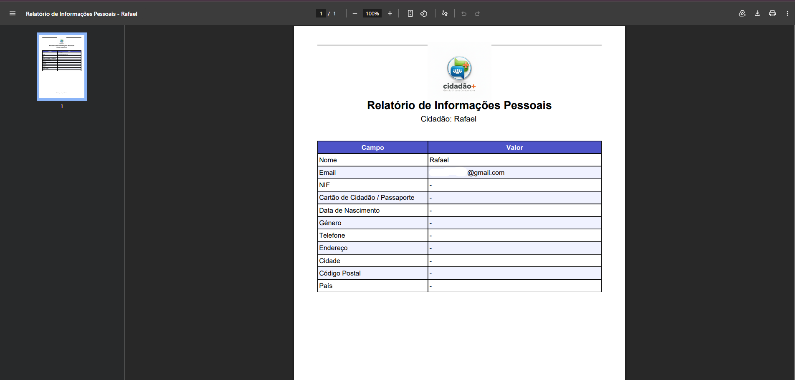 | 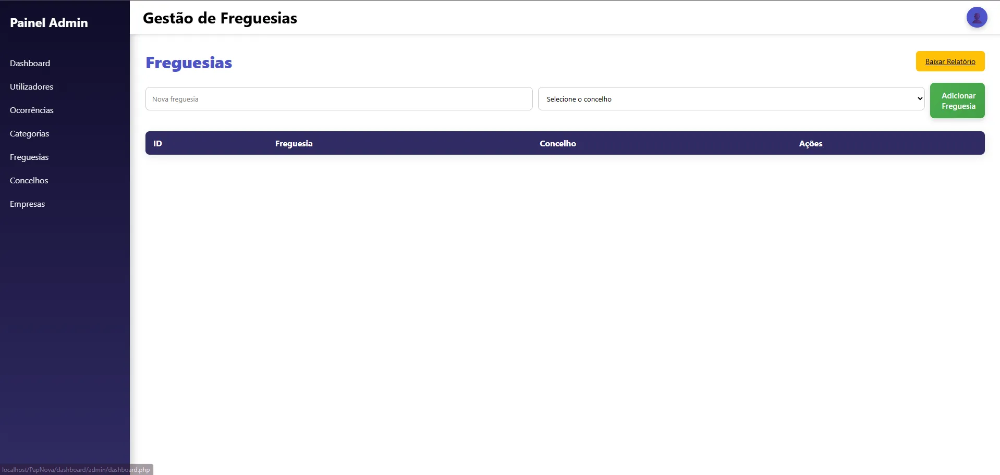 |

---

# 🧠 O que este projeto demonstra

Este projeto permitiu-me trabalhar em várias áreas do desenvolvimento de software:

- Desenvolvimento **Full-Stack**
- Desenvolvimento de interfaces web
- Programação em PHP
- Desenvolvimento de funcionalidades com JavaScript
- Bases de dados relacionais
- Autenticação e gestão de sessões
- Segurança de passwords
- Autenticação de dois fatores
- Envio de e-mails
- Gestão de utilizadores
- Desenvolvimento de dashboards
- Organização e estruturação de um projeto completo

---

# 👨‍💻 Desenvolvedor

### Rafael

**Web Developer**

---

   

  **Cidadão+**

  *Projeto desenvolvido para a Prova de Aptidão Profissional • 2026*

