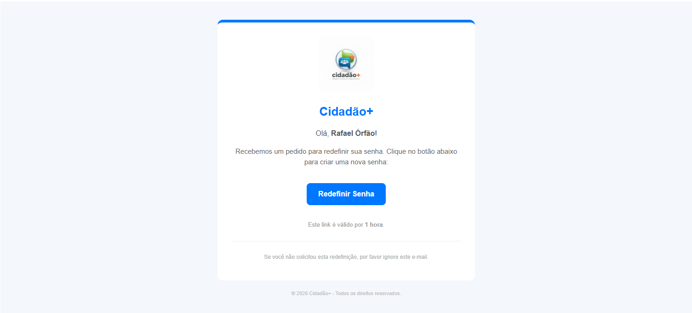
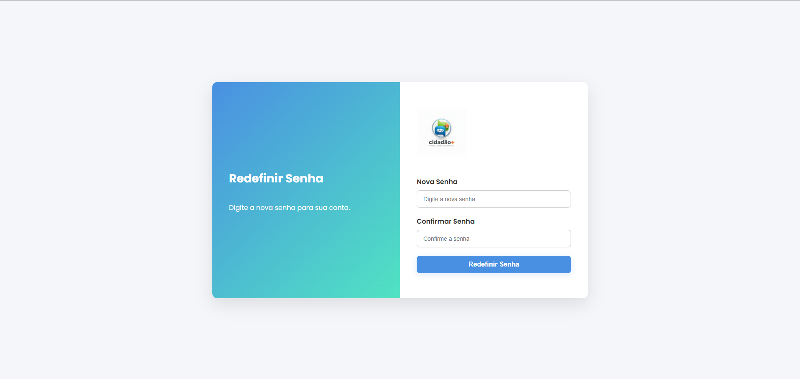
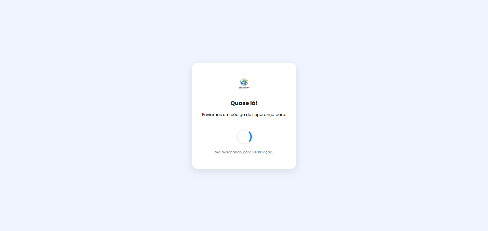
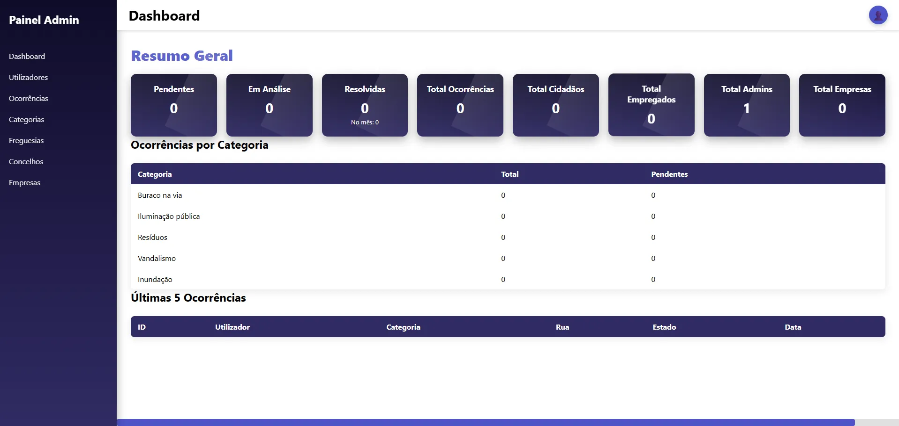
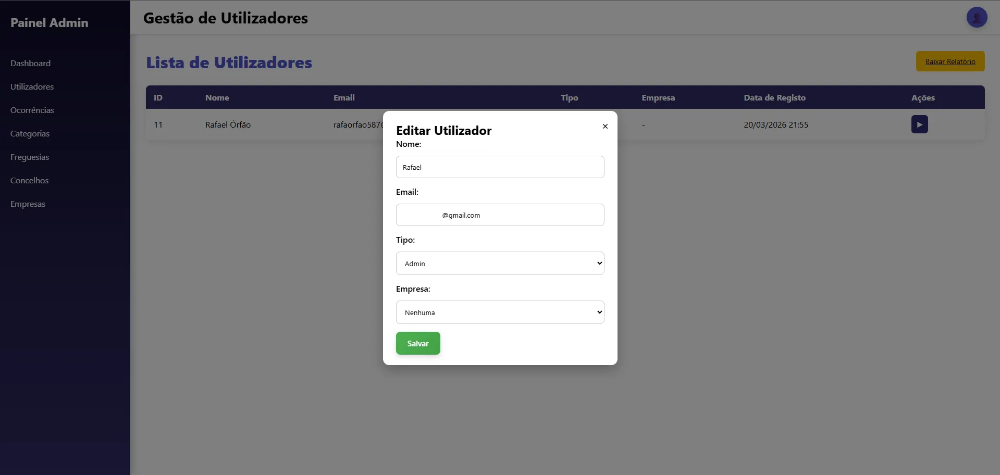
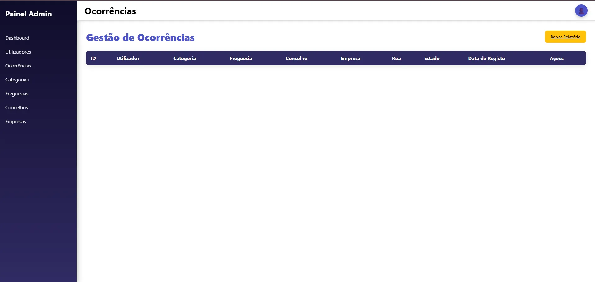
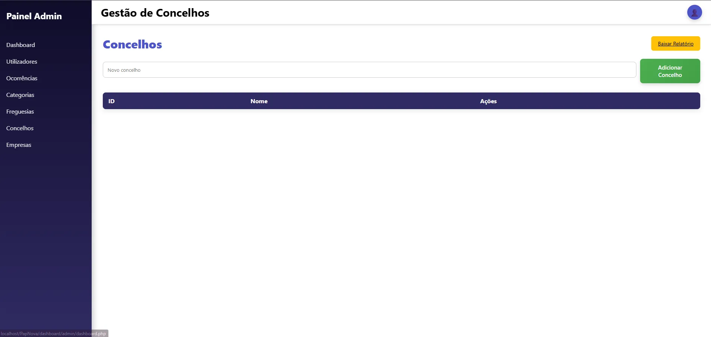
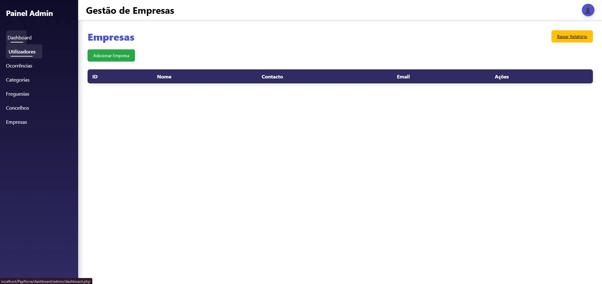

#  Cidadão+ — Gestão Urbana Inteligente

> **Projeto de Aptidão Profissional (PAP)**  
> Curso Técnico de Gestão e Programação de Sistemas Informáticos • **2026**

---

  
   
  <h1>Cidadão+</h1>
  
<i>A aproximar os munícipes da administração pública.</i>

---

## 📝 Descrição do Projeto

O **Cidadão+** é uma plataforma web inovadora concebida para estreitar a ligação entre os munícipes e a administração pública.

A aplicação permite ao cidadão **reportar, monitorizar e acompanhar ocorrências urbanas em tempo real**, promovendo eficiência e transparência.

---

## 🛠️ Stack Tecnológica

| Camada | Tecnologias |
| :--- | :--- |
| **Backend** | PHP • MySQL |
| **Frontend** | HTML • CSS • JavaScript |
| **Segurança** | 2FA • PHPMailer • bcrypt |

---

## 🚀 Funcionalidades

- Reporte de ocorrências com imagem  
- Acompanhamento de estado  
- Dashboard do cidadão  
- Painel administrativo completo  
- Sistema de autenticação seguro (2FA)

---

## 📸 Demonstração do Sistema

---

### 🔐 Módulo 1: Acesso e Registo

|  |  |  |
| :---: | :---: | :---: |
| Página Inicial | Login | Registo |

---

### 🛡️ Módulo 2: Segurança

|  |  |  |
| :---: | :---: | :---: |
| Recuperação | Email | Nova Password |

|  |  |  |
| :---: | :---: | :---: |
| 2FA | Código | Token |

---

### 🙋‍♂️ Módulo 3: Cidadão

|  |  |  |
| :---: | :---: | :---: |
| Reportar | Perfil | Dashboard |

---

### ⚙️ Módulo 4: Admin

|  |  |  |  |
| :---: | :---: | :---: | :---: |
| Dashboard | Utilizadores | Editar User | Editar Dados |

|  |  |
| :---: | :---: |
| Ocorrências | Tipos |

|  |  |  |
| :---: | :---: | :---: |
| Freguesias | Concelhos | Empresas |

---

## 👨‍💻 Desenvolvedor

**Rafael**  
Fullstack Developer (PHP • JS • MySQL)  
Projeto PAP 2026
